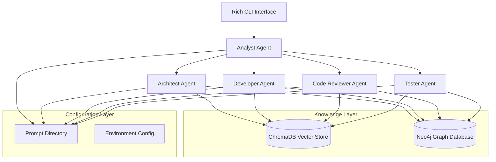
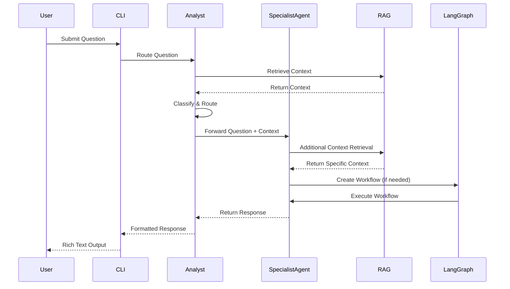

# Design Document

## Overview

The Deep Agent System is a sophisticated multi-agent framework built on LangChain and LangGraph that provides intelligent question routing and collaborative problem-solving capabilities. The system features a hierarchical agent architecture where an Analyst agent serves as the primary router, directing questions to specialized agents (Architect, Developer, Code Reviewer, Tester) based on content analysis. The system integrates both vector-based RAG (ChromaDB) and graph-based RAG (Neo4j) for comprehensive knowledge retrieval and supports dynamic LangGraph workflow creation for complex multi-step processes.

## Architecture

### High-Level Architecture



### Agent Communication Flow



## Components and Interfaces

### 1. Base Agent Framework

**BaseAgent Class**
```python
class BaseAgent:
    def __init__(self, config: AgentConfig, prompt_manager: PromptManager, rag_manager: RAGManager)
    def process_message(self, message: Message) -> Response
    def communicate_with_agent(self, agent_id: str, message: Message) -> Response
    def retrieve_context(self, query: str, retrieval_type: RetrievalType) -> Context
    def create_workflow(self, workflow_spec: WorkflowSpec) -> LangGraphWorkflow
```

**AgentConfig Interface**
```python
@dataclass
class AgentConfig:
    agent_id: str
    agent_type: AgentType
    model_config: ModelConfig
    prompt_templates: Dict[str, str]
    capabilities: List[Capability]
    rag_enabled: bool
    graph_rag_enabled: bool
```

### 2. Specialized Agent Implementations

**AnalystAgent (Router/Classifier)**
- Inherits from BaseAgent
- Specializes in question classification and routing
- Uses classification prompts to determine question type
- Routes to appropriate specialist agents
- Aggregates responses from multiple agents when needed

**ArchitectAgent**
- Inherits from BaseAgent
- Focuses on solution design and system architecture
- Uses design-focused prompts and templates
- Leverages graph RAG for understanding system relationships
- Creates architectural diagrams and explanations

**DeveloperAgent**
- Inherits from BaseAgent
- Specializes in code generation and implementation
- Uses coding-focused prompts and best practices
- Integrates with vector RAG for code examples and patterns
- Supports multiple programming languages and frameworks

**CodeReviewerAgent**
- Inherits from BaseAgent
- Focuses on code analysis, review, and improvement suggestions
- Uses review-focused prompts and quality guidelines
- Leverages both vector and graph RAG for best practices
- Provides detailed feedback and recommendations

**TesterAgent**
- Inherits from BaseAgent
- Specializes in test creation, validation, and quality assurance
- Uses testing-focused prompts and methodologies
- Integrates with RAG for testing patterns and frameworks
- Supports various testing types (unit, integration, e2e)

### 3. Prompt Management System

**PromptManager Class**
```python
class PromptManager:
    def __init__(self, prompt_dir: str)
    def load_prompts(self) -> Dict[str, str]
    def get_prompt(self, agent_type: str, prompt_name: str) -> str
    def reload_prompts(self) -> None
    def validate_prompts(self) -> bool
```

**Prompt Directory Structure**
```
prompts/
├── analyst/
│   ├── classification.txt
│   ├── routing.txt
│   └── aggregation.txt
├── architect/
│   ├── design.txt
│   ├── explanation.txt
│   └── diagram.txt
├── developer/
│   ├── implementation.txt
│   ├── code_generation.txt
│   └── debugging.txt
├── code_reviewer/
│   ├── review.txt
│   ├── feedback.txt
│   └── improvement.txt
└── tester/
    ├── test_creation.txt
    ├── validation.txt
    └── quality_assurance.txt
```

### 4. RAG Integration Layer

**RAGManager Class**
```python
class RAGManager:
    def __init__(self, vector_store: ChromaDBStore, graph_store: Neo4jStore)
    def retrieve_vector_context(self, query: str, k: int = 5) -> List[Document]
    def retrieve_graph_context(self, query: str, depth: int = 2) -> GraphContext
    def hybrid_retrieve(self, query: str) -> CombinedContext
    def ingest_documents(self, documents: List[Document]) -> None
    def build_knowledge_graph(self, documents: List[Document]) -> None
```

**ChromaDB Integration**
- Vector embeddings for semantic similarity search
- Document chunking and indexing strategies
- Metadata filtering and hybrid search capabilities
- Persistent storage and collection management

**Neo4j Integration**
- Entity and relationship extraction from documents
- Graph-based traversal for connected information
- Cypher query generation for complex relationships
- Knowledge graph visualization and exploration

### 5. LangGraph Workflow Engine

**WorkflowManager Class**
```python
class WorkflowManager:
    def __init__(self, agents: Dict[str, BaseAgent])
    def create_workflow(self, workflow_spec: WorkflowSpec) -> StateGraph
    def execute_workflow(self, workflow: StateGraph, initial_state: State) -> WorkflowResult
    def get_workflow_templates(self) -> Dict[str, WorkflowTemplate]
```

**Dynamic Workflow Creation**
- Template-based workflow generation
- Agent coordination and state management
- Conditional routing and parallel execution
- Error handling and recovery mechanisms

### 6. CLI Interface

**CLIManager Class**
```python
class CLIManager:
    def __init__(self, agent_system: AgentSystem)
    def start_interactive_session(self) -> None
    def process_user_input(self, input_text: str) -> None
    def display_response(self, response: Response) -> None
    def format_code_output(self, code: str, language: str) -> None
```

**Rich Text Features**
- Syntax highlighting for code blocks
- Colored output for different agent responses
- Progress indicators for long-running operations
- Interactive menus and command completion

## Data Models

### Core Message Types

```python
@dataclass
class Message:
    id: str
    sender_id: str
    recipient_id: str
    content: str
    message_type: MessageType
    metadata: Dict[str, Any]
    timestamp: datetime

@dataclass
class Response:
    message_id: str
    agent_id: str
    content: str
    confidence_score: float
    context_used: List[str]
    workflow_id: Optional[str]
    metadata: Dict[str, Any]

@dataclass
class Context:
    documents: List[Document]
    graph_data: Optional[GraphData]
    relevance_scores: List[float]
    retrieval_method: RetrievalType
```

### Configuration Models

```python
@dataclass
class SystemConfig:
    agents: Dict[str, AgentConfig]
    rag_config: RAGConfig
    prompt_dir: str
    model_configs: Dict[str, ModelConfig]
    database_configs: Dict[str, DatabaseConfig]

@dataclass
class RAGConfig:
    vector_store_config: ChromaDBConfig
    graph_store_config: Neo4jConfig
    embedding_model: str
    chunk_size: int
    chunk_overlap: int
    retrieval_k: int
```

## Error Handling

### Exception Hierarchy

```python
class DeepAgentException(Exception): pass
class AgentCommunicationError(DeepAgentException): pass
class PromptLoadError(DeepAgentException): pass
class RAGRetrievalError(DeepAgentException): pass
class WorkflowExecutionError(DeepAgentException): pass
class ConfigurationError(DeepAgentException): pass
```

### Error Recovery Strategies

1. **Agent Communication Failures**
   - Retry mechanisms with exponential backoff
   - Fallback to alternative agents
   - Graceful degradation of functionality

2. **RAG Retrieval Failures**
   - Fallback between vector and graph retrieval
   - Cached context for offline operation
   - Default context when retrieval fails

3. **Workflow Execution Errors**
   - Checkpoint and resume capabilities
   - Partial result recovery
   - Alternative workflow paths

4. **Configuration Errors**
   - Validation at startup
   - Default configuration fallbacks
   - Clear error messages and suggestions

## Testing Strategy

### Unit Testing
- Individual agent functionality testing
- Prompt template validation
- RAG retrieval accuracy testing
- Configuration loading and validation
- Message serialization/deserialization

### Integration Testing
- Agent-to-agent communication flows
- End-to-end question routing and processing
- RAG integration with both ChromaDB and Neo4j
- LangGraph workflow execution
- CLI interface functionality

### Performance Testing
- Response time benchmarks for different question types
- RAG retrieval performance under load
- Memory usage optimization for large knowledge bases
- Concurrent agent operation testing

### Quality Assurance
- Prompt effectiveness evaluation
- Response quality metrics
- Knowledge retrieval relevance scoring
- User experience testing for CLI interface

### Test Data Management
- Synthetic question datasets for each agent type
- Knowledge base fixtures for RAG testing
- Mock agent responses for integration testing
- Performance benchmarking datasets

### Continuous Testing
- Automated test execution on code changes
- Regression testing for agent behavior
- Performance monitoring and alerting
- Quality metrics tracking and reporting