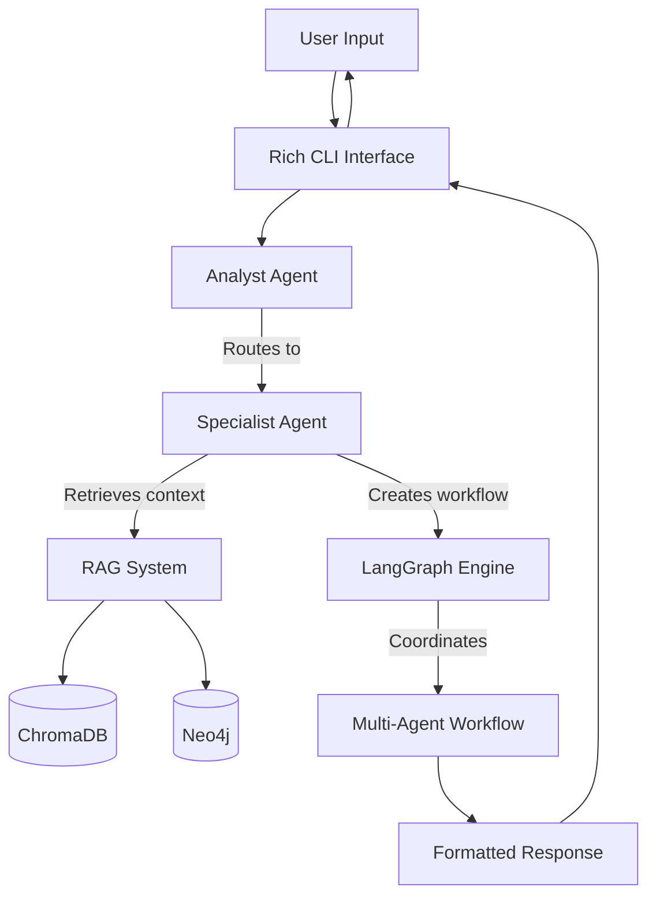

# Deep Agent System

A sophisticated multi-agent system using LangChain and LangGraph that intelligently routes questions to specialized agents based on content analysis. The system features configurable prompts, RAG capabilities with both vector and graph databases, and a rich CLI interface for seamless user interaction.

## 🚀 Features

- **🤖 Multi-Agent Architecture**: Analyst, Architect, Developer, Code Reviewer, and Tester agents
- **🧠 Intelligent Routing**: Automatic question classification and routing to appropriate specialists
- **📚 Dual RAG Integration**: Vector-based (ChromaDB) and graph-based (Neo4j) retrieval
- **🔄 Dynamic Workflows**: LangGraph-powered multi-agent collaboration
- **🎨 Rich CLI Interface**: Beautiful command-line interface with syntax highlighting, colored output, and interactive features
- **🔌 Multi-Provider LLM Support**: Works with OpenAI, Anthropic, OpenRouter, Lambda AI, Together AI, Hugging Face, Ollama, and custom endpoints
- **⚙️ Configurable Prompts**: Externalized prompts for easy customization
- **🔧 Hot-Reloadable Configuration**: Update prompts and settings without restart
- **📊 Comprehensive Monitoring**: Built-in logging and performance metrics

### ✨ Rich CLI Highlights

- **🎨 Syntax Highlighting**: Automatic code detection and highlighting for 100+ languages
- **🌈 Agent Color Coding**: Each agent type has distinct colors (Analyst=Blue, Developer=Yellow, etc.)
- **📊 Interactive Dashboard**: Real-time system status with beautiful tables and indicators
- **💬 Conversation History**: Track and replay previous interactions with rich formatting
- **🔄 Hot Reload**: Update configuration and prompts without restarting (`/reload` command)
- **🐛 Debug Mode**: Enhanced error display with stack traces and helpful suggestions
- **⏳ Progress Indicators**: Animated spinners and progress bars for long operations
- **🎯 Command System**: Extensible command processor with validation and completion
- **📱 Responsive Design**: Adapts to terminal width with smart text wrapping

## 📋 Prerequisites

Before installing the Deep Agent System, ensure you have:

- **Python 3.11 or higher** ([Download Python](https://www.python.org/downloads/))
- **UV package manager** ([Installation guide](https://docs.astral.sh/uv/getting-started/installation/))
- **Git** for cloning the repository
- **OpenAI API key** for LLM functionality
- **ChromaDB** (optional, for vector RAG)
- **Neo4j** (optional, for graph RAG)

### Installing UV

Choose your platform:

**macOS/Linux:**
```bash
curl -LsSf https://astral.sh/uv/install.sh | sh
```

**Windows:**
```powershell
powershell -c "irm https://astral.sh/uv/install.ps1 | iex"
```

**With pip:**
```bash
pip install uv
```

## 🛠️ Installation

### 1. Clone the Repository

```bash
git clone https://github.com/your-org/deep-agent-system.git
cd deep-agent-system
```

### 2. Set Up Python Environment

Create and activate a virtual environment using UV:

```bash
# Create virtual environment
uv venv

# Activate virtual environment
# On macOS/Linux:
source .venv/bin/activate

# On Windows:
.venv\Scripts\activate
```

### 3. Install Dependencies

```bash
# Install the package in development mode
uv pip install -e .

# Or install with development dependencies
uv pip install -e ".[dev]"
```

### 4. Environment Configuration

Copy the environment template and configure your settings:

```bash
cpgit@github.com:pradhyu/blackbeard-extension.git .env.template .env
```

Edit the `.env` file with your configuration (see [Configuration Guide](#-configuration-guide) below).

### 5. Verify Installation

Test that the installation was successful:

```bash
# Check version and system info
deep-agent version

# Verify system status
deep-agent status

# Try the Rich CLI demo (optional)
python examples/cli_demo.py

# Test a simple question
deep-agent ask "What is Python?"
```

## ⚙️ Configuration Guide

The Deep Agent System uses environment variables for configuration. All settings are defined in the `.env` file.

### Required Configuration

#### LLM Provider Configuration

The Deep Agent System supports multiple LLM providers. Choose your preferred provider and configure accordingly:

```bash
# Select your LLM provider
LLM_PROVIDER=openai  # Options: openai, anthropic, openrouter, lambda_ai, together_ai, huggingface, ollama, custom
```

**OpenAI Configuration:**
```bash
OPENAI_API_KEY=sk-your-api-key-here
OPENAI_MODEL=gpt-4-turbo-preview
OPENAI_TEMPERATURE=0.7
OPENAI_MAX_TOKENS=4000
OPENAI_BASE_URL=  # Optional: Custom OpenAI-compatible endpoint
```

**Anthropic Configuration:**
```bash
ANTHROPIC_API_KEY=your_anthropic_api_key_here
ANTHROPIC_MODEL=claude-3-sonnet-20240229
ANTHROPIC_TEMPERATURE=0.7
ANTHROPIC_MAX_TOKENS=4000
```

**OpenRouter Configuration:**
```bash
OPENROUTER_API_KEY=your_openrouter_api_key_here
OPENROUTER_MODEL=openai/gpt-4-turbo-preview
OPENROUTER_SITE_URL=https://yoursite.com  # Optional
OPENROUTER_APP_NAME=Deep Agent System
```

**Lambda AI Configuration:**
```bash
LAMBDA_AI_API_KEY=your_lambda_ai_api_key_here
LAMBDA_AI_MODEL=hermes-2-pro-llama-3-8b
LAMBDA_AI_BASE_URL=https://api.lambdalabs.com/v1
```

**Together AI Configuration:**
```bash
TOGETHER_AI_API_KEY=your_together_ai_api_key_here
TOGETHER_AI_MODEL=meta-llama/Llama-2-70b-chat-hf
```

**Hugging Face Configuration:**
```bash
HUGGINGFACE_API_KEY=your_huggingface_api_key_here
HUGGINGFACE_MODEL=microsoft/DialoGPT-large
```

**Ollama Configuration (Local):**
```bash
OLLAMA_MODEL=llama2
OLLAMA_HOST=http://localhost:11434
# No API key required for local Ollama
```

**Custom Provider Configuration:**
```bash
CUSTOM_MODEL=your_custom_model_name
CUSTOM_API_KEY=your_custom_api_key
CUSTOM_BASE_URL=https://your-custom-endpoint.com/v1
CUSTOM_EXTRA_HEADERS={"Authorization": "Bearer token"}
CUSTOM_EXTRA_PARAMS={"top_p": 0.9}
```

#### Prompt Directory
```bash
# Path to prompt templates (relative to project root)
PROMPT_DIR=./prompts
```

### Optional Configuration

#### ChromaDB (Vector RAG)
```bash
# Enable vector-based RAG
VECTOR_STORE_ENABLED=true

# ChromaDB settings
CHROMADB_HOST=localhost
CHROMADB_PORT=8000
CHROMADB_COLLECTION_NAME=deep_agent_knowledge
CHROMADB_PERSIST_DIRECTORY=./data/chromadb
```

#### Neo4j (Graph RAG)
```bash
# Enable graph-based RAG
GRAPH_STORE_ENABLED=true

# Neo4j connection
NEO4J_URI=bolt://localhost:7687
NEO4J_USERNAME=neo4j
NEO4J_PASSWORD=your-password-here
NEO4J_DATABASE=neo4j
```

#### RAG Settings
```bash
# Embedding configuration
EMBEDDING_MODEL=text-embedding-ada-002
EMBEDDING_DIMENSION=1536

# Retrieval parameters
RAG_CHUNK_SIZE=1000
RAG_CHUNK_OVERLAP=200
RAG_RETRIEVAL_K=5
RAG_SIMILARITY_THRESHOLD=0.7
```

#### CLI Appearance
```bash
# Rich CLI settings
CLI_THEME=dark
CLI_SYNTAX_HIGHLIGHTING=true
CLI_SHOW_PROGRESS=true
CLI_MAX_WIDTH=120
```

#### Logging
```bash
# Logging configuration
LOG_LEVEL=INFO
LOG_FORMAT=json
LOG_FILE=./logs/deep_agent_system.log
ENABLE_DEBUG_LOGGING=false
```

### 🔌 Supported LLM Providers

The Deep Agent System supports multiple LLM providers, allowing you to choose the best option for your needs:

| Provider | Description | API Key Required | Local/Cloud |
|----------|-------------|------------------|-------------|
| **OpenAI** | GPT-4, GPT-3.5-turbo models | ✅ | Cloud |
| **Anthropic** | Claude 3 models (Sonnet, Opus, Haiku) | ✅ | Cloud |
| **OpenRouter** | Access to 100+ models via unified API | ✅ | Cloud |
| **Lambda AI** | High-performance inference for open models | ✅ | Cloud |
| **Together AI** | Open-source models with fast inference | ✅ | Cloud |
| **Hugging Face** | Inference API for thousands of models | ✅ | Cloud |
| **Ollama** | Local model inference (Llama, Mistral, etc.) | ❌ | Local |
| **Custom** | Any OpenAI-compatible API endpoint | Varies | Both |

#### Provider-Specific Features

**OpenAI:**
- Best-in-class GPT-4 models
- Function calling support
- Vision capabilities (GPT-4V)

**Anthropic:**
- Claude 3 with excellent reasoning
- Large context windows (up to 200K tokens)
- Strong safety features

**OpenRouter:**
- Access to multiple providers through one API
- Cost optimization across models
- Real-time model availability

**Lambda AI:**
- Optimized for open-source models
- High-performance GPU infrastructure
- Competitive pricing

**Together AI:**
- Fast inference for open models
- Support for fine-tuned models
- Batch processing capabilities

**Hugging Face:**
- Thousands of available models
- Easy model switching
- Community-driven ecosystem

**Ollama:**
- Complete privacy (local inference)
- No API costs
- Support for quantized models

**Custom:**
- Use any OpenAI-compatible endpoint
- Self-hosted models
- Enterprise deployments

### Configuration Validation

Validate your configuration:

```bash
deep-agent status --verbose
```

## 🎯 Usage Examples

### Basic Question Asking

Ask simple questions directly from the command line:

```bash
# Programming question (routed to Developer Agent)
deep-agent ask "How do I implement a REST API in FastAPI?"

# Architecture question (routed to Architect Agent)
deep-agent ask "Design a microservices architecture for an e-commerce platform"

# Code review question (routed to Code Reviewer Agent)
deep-agent ask "Review this Python function for potential improvements"

# Testing question (routed to Tester Agent)
deep-agent ask "Create unit tests for a user authentication system"
```

### 🎨 Rich CLI Interface

The Deep Agent System features a beautiful, Rich-powered CLI interface with syntax highlighting, colored output, and interactive features.

#### Quick Commands

```bash
# Show system version and information
deep-agent version

# Check system status and agent health
deep-agent status

# Get help for any command
deep-agent --help
deep-agent ask --help
deep-agent interactive --help
```

#### Interactive Mode

Start an interactive session for ongoing conversations with enhanced features:

```bash
deep-agent interactive
```

**Interactive Mode Features:**
- 🎨 **Rich formatting** with colored panels and syntax highlighting
- 💬 **Conversation history** tracking and display
- 🔄 **Hot-reload** configuration and prompts
- 📊 **Real-time status** and agent information
- 🎯 **Command completion** and validation
- 🐛 **Debug mode** with detailed error information

#### Interactive Commands

Once in interactive mode, use these commands:

```bash
# Show all available commands with descriptions
/help

# Display detailed system status
/status

# List all registered agents and their status
/agents

# Show conversation history (last 10 by default)
/history
/history 20  # Show last 20 messages

# Clear the screen
/clear

# Reload prompts and configuration without restart
/reload

# Toggle debug mode for detailed output
/debug

# Exit the interactive session
/quit
```

#### Advanced CLI Options

**Verbose Output with Rich Formatting:**
```bash
deep-agent ask --verbose "Explain the SOLID principles"
```

**Debug Mode with Enhanced Error Display:**
```bash
deep-agent ask --debug "Debug this Python code"
```

**Custom Configuration:**
```bash
deep-agent ask --config /path/to/custom/.env "Your question here"
```

**Output Format Options:**
```bash
# Rich formatted output (default) - Beautiful panels and syntax highlighting
deep-agent ask --format rich "Design a database schema"

# JSON output for programmatic use
deep-agent ask --format json "What is dependency injection?"

# Plain text output for simple parsing
deep-agent ask --format plain "Explain async/await in Python"
```

### 🎯 CLI Features Showcase

#### 1. Syntax Highlighting

The CLI automatically detects and highlights code in responses:

```bash
deep-agent ask "Show me a Python FastAPI example"
```

**Output includes:**
- 🎨 **Syntax-highlighted code blocks** with line numbers
- 🏷️ **Language detection** (Python, JavaScript, SQL, etc.)
- 📝 **Inline code formatting** with distinct styling
- 🎨 **Multiple themes** support (monokai, github-dark, etc.)

#### 2. Agent-Specific Color Coding

Each agent type has its own color scheme:

- 🔵 **Analyst Agent**: Blue panels and borders
- 🟢 **Architect Agent**: Green panels and borders  
- 🟡 **Developer Agent**: Yellow panels and borders
- 🔴 **Code Reviewer Agent**: Red panels and borders
- 🟣 **Tester Agent**: Magenta panels and borders

#### 3. Progress Indicators

Long-running operations show beautiful progress indicators:

```bash
deep-agent ask "Analyze this large codebase"
```

**Features:**
- ⏳ **Spinner animations** during processing
- 📊 **Progress bars** for multi-step operations
- ⏱️ **Elapsed time** tracking
- 📝 **Status updates** with descriptive messages

#### 4. Enhanced Error Display

Errors are displayed with rich formatting and helpful context:

```bash
# Example error scenarios
deep-agent ask --config invalid.env "test question"
```

**Error Display Features:**
- 🚨 **Colored error panels** with clear titles
- 📋 **Detailed error information** with context
- 🔍 **Stack traces** in debug mode
- 💡 **Helpful suggestions** for common issues

#### 5. System Status Dashboard

View comprehensive system information:

```bash
deep-agent status --verbose
```

**Status Display Includes:**
- ✅ **Component health** with checkmarks/X marks
- 📊 **Agent status table** with active/inactive indicators
- 🔧 **Configuration validation** results
- 📈 **Performance metrics** and statistics
- 🗄️ **Database connection** status

### 🔄 Example Workflows

#### 1. Full Development Workflow with Rich Output

```bash
# Start interactive session for better experience
deep-agent interactive

# 1. Architecture design (routed to Architect Agent - Green theme)
> Design a blog application architecture with microservices

# 2. Implementation (routed to Developer Agent - Yellow theme)  
> Implement the blog post model in Python with FastAPI

# 3. Code review (routed to Code Reviewer Agent - Red theme)
> Review this blog post model for security and best practices

# 4. Testing (routed to Tester Agent - Magenta theme)
> Create comprehensive tests for the blog post model

# 5. Check conversation history
> /history

# 6. Exit
> /quit
```

#### 2. Code Analysis Workflow

```bash
# Quick status check
deep-agent status

# Analyze code with rich formatting
deep-agent ask --verbose "Analyze this Python class for design patterns:

class UserManager:
    def __init__(self, db):
        self.db = db
    
    def create_user(self, data):
        # Implementation here
        pass"

# Follow up in interactive mode
deep-agent interactive
> /debug  # Enable debug mode
> Suggest performance improvements for the UserManager class
> Create integration tests for UserManager
> /history 5  # Show last 5 interactions
```

#### 3. Configuration and Troubleshooting

```bash
# Check system health
deep-agent status --verbose

# Test with debug output
deep-agent ask --debug "Test system functionality"

# Interactive troubleshooting
deep-agent interactive
> /status     # Check system status
> /agents     # List agent status  
> /reload     # Reload configuration
> /debug      # Toggle debug mode
> Test question after reload
```

### 🎨 CLI Customization

#### Theme Configuration

Customize the CLI appearance in your `.env` file:

```bash
# CLI appearance settings
CLI_THEME=dark                    # Options: dark, light, monokai
CLI_SYNTAX_HIGHLIGHTING=true     # Enable/disable syntax highlighting
CLI_SHOW_PROGRESS=true           # Show progress indicators
CLI_MAX_WIDTH=120                # Maximum terminal width
CLI_SHOW_METADATA=false          # Show response metadata by default
CLI_AUTO_WRAP=true               # Auto-wrap long lines
```

#### Color Scheme Customization

Advanced users can customize agent colors by modifying the CLI manager:

```python
# In deep_agent_system/cli/manager.py
AGENT_COLORS = {
    AgentType.ANALYST: "cyan",      # Change from blue to cyan
    AgentType.ARCHITECT: "bright_green",  # Brighter green
    AgentType.DEVELOPER: "orange",   # Change from yellow to orange
    # ... etc
}
```

### 📱 CLI Demo

Try the CLI demo to see all features in action:

```bash
# Run the interactive demo
python examples/cli_demo.py
```

This demo showcases:
- Welcome banners and panels
- Code syntax highlighting
- Different message types (success, warning, error, info)
- System status displays
- Help system formatting
- Tree views for hierarchical data
- Progress indicators

### 🎬 CLI Examples Gallery

#### Example 1: Code Implementation Request

```bash
deep-agent ask "Create a Python FastAPI endpoint for user authentication"
```

**Rich Output Preview:**
```
╭────────────────────────── Response from developer_agent ──────────────────────────╮
│ Here's a FastAPI endpoint for user authentication:                                │
│                                                                                   │
│    1 from fastapi import FastAPI, HTTPException, Depends                          │
│    2 from fastapi.security import HTTPBearer, HTTPAuthorizationCredentials       │
│    3 from pydantic import BaseModel                                               │
│    4                                                                              │
│    5 app = FastAPI()                                                              │
│    6 security = HTTPBearer()                                                      │
│    7                                                                              │
│    8 class LoginRequest(BaseModel):                                               │
│    9     username: str                                                            │
│   10     password: str                                                            │
│                                                                                   │
│ This endpoint provides secure authentication with JWT tokens.                     │
╰─────────────────────────── Confidence: 0.95 | Time: 14:23:15 ───────────────────╯
```

#### Example 2: Interactive Session

```bash
deep-agent interactive
```

**Interactive Session Preview:**
```
╭───────────────────────────────────────── Welcome ─────────────────────────────────────────╮
│                                                                                           │
│  Deep Agent System                                                                        │
│  A sophisticated multi-agent framework using LangChain and LangGraph                      │
│                                                                                           │
╰───────────────────────────────────────────────────────────────────────────────────────────╯

Interactive Mode Started

Type your questions and press Enter to get responses from the agent system.

Available Commands:
  /help     - Show available commands
  /status   - Show system status
  /agents   - List available agents
  /history  - Show conversation history
  /clear    - Clear the screen
  /reload   - Reload prompts and configuration
  /debug    - Toggle debug mode
  /quit     - Exit the session

❯ What are the SOLID principles?
```

#### Example 3: System Status

```bash
deep-agent status --verbose
```

**Status Output Preview:**
```
          System Status           
┏━━━━━━━━━━━━━━━━━━━━━━━┳━━━━━━━━┓
┃ Component             ┃ Status ┃
┡━━━━━━━━━━━━━━━━━━━━━━━╇━━━━━━━━┩
│ Initialized           │ ✓      │
│ Running               │ ✓      │
│ Agents Count          │ 5      │
│ Config Manager        │ ✓      │
│ Prompt Manager        │ ✓      │
│ RAG Manager           │ ✓      │
│ Communication Manager │ ✓      │
│ Workflow Manager      │ ✓      │
└───────────────────────┴────────┘

            Registered Agents             
┏━━━━━━━━━━━━━━━┳━━━━━━━━━━━━━━━┳━━━━━━━━┓
┃ Agent ID      ┃ Type          ┃ Status ┃
┡━━━━━━━━━━━━━━━╇━━━━━━━━━━━━━━━╇━━━━━━━━┩
│ analyst       │ analyst       │ ✓      │
│ architect     │ architect     │ ✓      │
│ developer     │ developer     │ ✓      │
│ code_reviewer │ code_reviewer │ ✓      │
│ tester        │ tester        │ ✓      │
└───────────────┴───────────────┴────────┘
```

#### Example 4: Error Handling

```bash
deep-agent ask --debug "Invalid request"
```

**Error Display Preview:**
```
╭────────────────────────────────────────── Error ──────────────────────────────────────────╮
│ Failed to process message                                                                  │
│                                                                                           │
│ Details:                                                                                  │
│ OpenAI API rate limit exceeded. Please try again in 60 seconds.                           │
│                                                                                           │
│ Suggestions:                                                                              │
│ • Check your API usage limits                                                             │
│ • Consider upgrading your OpenAI plan                                                     │
│ • Try again after the rate limit resets                                                  │
╰───────────────────────────────────────────────────────────────────────────────────────────╯
```

### 🚀 Quick Start with CLI

Get started with the Rich CLI interface in 3 steps:

```bash
# 1. Check system status
deep-agent status

# 2. Try a simple question
deep-agent ask "What is Python?"

# 3. Start interactive mode for full experience
deep-agent interactive
```

### 🔄 Quick Provider Switching

Switch between different LLM providers easily:

```bash
# Use OpenAI (default)
export LLM_PROVIDER=openai
export OPENAI_API_KEY=sk-your-key-here
deep-agent ask "Explain machine learning"

# Switch to OpenRouter for access to multiple models
export LLM_PROVIDER=openrouter
export OPENROUTER_API_KEY=sk-or-your-key-here
export OPENROUTER_MODEL=anthropic/claude-3-sonnet
deep-agent ask "Same question, different model"

# Use Lambda AI for high-performance inference
export LLM_PROVIDER=lambda_ai
export LAMBDA_AI_API_KEY=your-lambda-key
export LAMBDA_AI_MODEL=hermes-2-pro-llama-3-8b
deep-agent ask "Fast inference with open models"

# Use local Ollama for privacy
export LLM_PROVIDER=ollama
export OLLAMA_MODEL=llama2
deep-agent ask "Completely private, local inference"
```

**Pro Tips:**
- Use `Tab` for command completion (where supported)
- Press `Ctrl+C` to interrupt long operations
- Use `/debug` in interactive mode for troubleshooting
- Try different `--format` options for various use cases
- Use `--verbose` for detailed operation information
- Test provider configurations with: `python examples/multi_provider_demo.py`

## 🖥️ CLI Command Reference

### Core Commands

#### `deep-agent ask`
Ask questions to the agent system with rich formatted responses.

```bash
# Basic usage
deep-agent ask "Your question here"

# With options
deep-agent ask --verbose --debug --format rich "Complex question"

# Using different output formats
deep-agent ask --format json "API design question"     # JSON output
deep-agent ask --format plain "Simple question"        # Plain text
deep-agent ask --format rich "Code review request"     # Rich formatting (default)
```

**Options:**
- `--config, -c`: Custom configuration file path
- `--verbose, -v`: Enable verbose output with detailed information
- `--debug, -d`: Enable debug mode with error traces
- `--format, -f`: Output format (rich, json, plain)

#### `deep-agent interactive`
Start an interactive session with full CLI features.

```bash
# Basic interactive mode
deep-agent interactive

# With custom configuration
deep-agent interactive --config /path/to/.env

# With debug mode enabled
deep-agent interactive --debug --verbose
```

**Options:**
- `--config, -c`: Custom configuration file path
- `--verbose, -v`: Enable verbose logging
- `--debug, -d`: Start with debug mode enabled

#### `deep-agent status`
Display system status and health information.

```bash
# Basic status
deep-agent status

# Detailed status with component information
deep-agent status --verbose

# Status with custom config
deep-agent status --config /path/to/.env
```

#### `deep-agent version`
Show version information and system details.

```bash
deep-agent version
```

### Interactive Mode Commands

When in interactive mode (`deep-agent interactive`), use these commands:

#### `/help [command]`
Show help information for all commands or a specific command.

```bash
/help              # Show all commands
/help status       # Show help for status command
/help history      # Show help for history command
```

#### `/status`
Display current system status and agent information.

```bash
/status            # Show system status dashboard
```

#### `/agents`
List all registered agents with their current status.

```bash
/agents            # Show agents table with status indicators
```

#### `/history [count]`
Display conversation history with rich formatting.

```bash
/history           # Show last 10 messages
/history 20        # Show last 20 messages
/history 5         # Show last 5 messages
```

#### `/clear`
Clear the terminal screen.

```bash
/clear             # Clear screen (alias: /cls)
```

#### `/reload`
Reload system configuration and prompts without restarting.

```bash
/reload            # Hot-reload prompts and configuration
```

#### `/debug`
Toggle debug mode on/off for detailed error information.

```bash
/debug             # Toggle debug mode
```

#### `/quit`
Exit the interactive session.

```bash
/quit              # Exit session (aliases: /exit, /q)
```

### 🎨 Rich CLI Features

#### Syntax Highlighting

The CLI automatically applies syntax highlighting to code blocks in responses:

**Supported Languages:**
- Python, JavaScript, TypeScript
- Java, C#, C++, Go, Rust
- SQL, HTML, CSS, JSON, YAML
- Bash, PowerShell, Dockerfile
- And many more...

**Example Output:**
```python
# This code will be syntax highlighted
def fibonacci(n):
    if n <= 1:
        return n
    return fibonacci(n-1) + fibonacci(n-2)
```

#### Color-Coded Agent Responses

Each agent type has distinct visual styling:

| Agent Type | Color | Description |
|------------|-------|-------------|
| 🔵 Analyst | Blue | Question routing and analysis |
| 🟢 Architect | Green | System design and architecture |
| 🟡 Developer | Yellow | Code implementation and examples |
| 🔴 Code Reviewer | Red | Code analysis and improvements |
| 🟣 Tester | Magenta | Testing strategies and test creation |

#### Progress Indicators

Long-running operations display animated progress:

```bash
⠋ Processing question...
⠙ Analyzing content...
⠹ Routing to specialist agent...
⠸ Generating response...
✓ Response complete! (2.3s)
```

#### Enhanced Error Display

Errors are shown with helpful context and formatting:

```bash
╭─ Error ─────────────────────────────────────────╮
│ Failed to connect to OpenAI API                 │
│                                                 │
│ Details:                                        │
│ Invalid API key. Please check your .env file.  │
╰─────────────────────────────────────────────────╯
```

#### System Status Dashboard

The status command shows a comprehensive system overview:

```bash
          System Status           
┏━━━━━━━━━━━━━━━━━━━━━━━┳━━━━━━━━┓
┃ Component             ┃ Status ┃
┡━━━━━━━━━━━━━━━━━━━━━━━╇━━━━━━━━┩
│ Initialized           │ ✓      │
│ Running               │ ✓      │
│ Agents Count          │ 5      │
│ Config Manager        │ ✓      │
│ Prompt Manager        │ ✓      │
│ RAG Manager           │ ✓      │
│ Communication Manager │ ✓      │
│ Workflow Manager      │ ✗      │
└───────────────────────┴────────┘
```

### 🔧 CLI Configuration

#### Environment Variables

Configure CLI behavior with these environment variables:

```bash
# CLI Appearance
CLI_THEME=dark                    # Color theme (dark, light, monokai)
CLI_SYNTAX_HIGHLIGHTING=true     # Enable syntax highlighting
CLI_SHOW_PROGRESS=true           # Show progress indicators
CLI_MAX_WIDTH=120                # Maximum terminal width
CLI_SHOW_METADATA=false          # Show response metadata by default
CLI_AUTO_WRAP=true               # Auto-wrap long lines

# CLI Behavior  
CLI_CONFIRM_EXIT=true            # Confirm before exiting interactive mode
CLI_SAVE_HISTORY=true            # Save conversation history
CLI_HISTORY_SIZE=100             # Maximum history entries
CLI_TIMEOUT=300                  # Command timeout in seconds
```

#### Custom Themes

Create custom color themes by modifying the CLI manager configuration:

```python
# Example custom theme
CUSTOM_THEME = {
    "primary": "bright_blue",
    "success": "bright_green", 
    "warning": "bright_yellow",
    "error": "bright_red",
    "info": "bright_cyan",
    "muted": "dim white"
}
```

### 📊 CLI Performance Tips

#### Optimize for Large Outputs

For better performance with large responses:

```bash
# Limit output width
export CLI_MAX_WIDTH=100

# Disable syntax highlighting for faster rendering
export CLI_SYNTAX_HIGHLIGHTING=false

# Use plain format for large outputs
deep-agent ask --format plain "Generate large code example"
```

#### Memory Management

For memory-intensive operations:

```bash
# Reduce history size
export CLI_HISTORY_SIZE=50

# Disable metadata display
export CLI_SHOW_METADATA=false
```

### 🐛 CLI Troubleshooting

#### Common Issues

**1. Colors not displaying correctly:**
```bash
# Check terminal color support
echo $TERM
export TERM=xterm-256color
```

**2. Syntax highlighting not working:**
```bash
# Verify Rich installation
pip show rich
# Re-enable in config
export CLI_SYNTAX_HIGHLIGHTING=true
```

**3. Interactive mode freezing:**
```bash
# Use Ctrl+C to interrupt
# Check for configuration issues
deep-agent status --debug
```

**4. Wide output getting cut off:**
```bash
# Increase terminal width or set max width
export CLI_MAX_WIDTH=150
```

#### Debug Mode

Enable debug mode for detailed troubleshooting:

```bash
# In ask command
deep-agent ask --debug "test question"

# In interactive mode
deep-agent interactive --debug
# Or toggle with /debug command
```

Debug mode provides:
- Detailed error traces
- Performance timing information
- Configuration validation details
- Network request/response logs

## 🏗️ Architecture Overview

### Agent Types

The system includes five specialized agents:

#### 1. **Analyst Agent** (Router)
- **Purpose**: Question classification and routing
- **Capabilities**: 
  - Analyzes incoming questions
  - Determines appropriate specialist agent
  - Aggregates multi-agent responses
- **Example Questions**: Any question (handles routing automatically)

#### 2. **Architect Agent**
- **Purpose**: Solution design and system architecture
- **Capabilities**:
  - System design and architecture patterns
  - Technology stack recommendations
  - Scalability and performance considerations
- **Example Questions**:
  - "Design a microservices architecture"
  - "What's the best database for this use case?"
  - "How should I structure this application?"

#### 3. **Developer Agent**
- **Purpose**: Code implementation and programming
- **Capabilities**:
  - Code generation and examples
  - Programming best practices
  - Framework and library guidance
- **Example Questions**:
  - "Implement a REST API endpoint"
  - "How do I use async/await in Python?"
  - "Create a React component for user login"

#### 4. **Code Reviewer Agent**
- **Purpose**: Code analysis and improvement
- **Capabilities**:
  - Code quality assessment
  - Security vulnerability detection
  - Performance optimization suggestions
- **Example Questions**:
  - "Review this function for improvements"
  - "Check this code for security issues"
  - "Optimize this database query"

#### 5. **Tester Agent**
- **Purpose**: Testing and quality assurance
- **Capabilities**:
  - Test case generation
  - Testing strategy recommendations
  - Quality assurance best practices
- **Example Questions**:
  - "Create unit tests for this class"
  - "Design a testing strategy"
  - "How do I test this async function?"

### Communication Flow



## 🗂️ RAG Setup and Knowledge Base

### ChromaDB Setup (Vector RAG)

#### 1. Install ChromaDB
```bash
# ChromaDB is included in dependencies, but you can install separately:
pip install chromadb
```

#### 2. Configure ChromaDB
In your `.env` file:
```bash
VECTOR_STORE_ENABLED=true
CHROMADB_HOST=localhost
CHROMADB_PORT=8000
CHROMADB_PERSIST_DIRECTORY=./data/chromadb
```

#### 3. Ingest Documents
```python
# Example: Ingesting documents programmatically
from deep_agent_system.rag.manager import RAGManager

rag_manager = RAGManager()
documents = [
    "Your documentation content here",
    "API reference materials",
    "Code examples and patterns"
]
await rag_manager.ingest_documents(documents)
```

### Neo4j Setup (Graph RAG)

#### 1. Install Neo4j
Download and install Neo4j Desktop or use Docker:

```bash
# Using Docker
docker run \
    --name neo4j \
    -p7474:7474 -p7687:7687 \
    -d \
    -v $HOME/neo4j/data:/data \
    -v $HOME/neo4j/logs:/logs \
    -v $HOME/neo4j/import:/var/lib/neo4j/import \
    -v $HOME/neo4j/plugins:/plugins \
    --env NEO4J_AUTH=neo4j/your-password \
    neo4j:latest
```

#### 2. Configure Neo4j
In your `.env` file:
```bash
GRAPH_STORE_ENABLED=true
NEO4J_URI=bolt://localhost:7687
NEO4J_USERNAME=neo4j
NEO4J_PASSWORD=your-password-here
```

#### 3. Build Knowledge Graph
```python
# Example: Building knowledge graph
from deep_agent_system.rag.graph_store import Neo4jStore

graph_store = Neo4jStore()
await graph_store.build_knowledge_graph(documents)
```

### Knowledge Base Ingestion

#### Supported Document Types
- Text files (.txt, .md)
- Code files (.py, .js, .java, etc.)
- Documentation (README, API docs)
- Configuration files

#### Ingestion Examples

**Command Line Ingestion:**
```bash
# Ingest a directory of documents
deep-agent ingest --path ./docs --recursive

# Ingest specific files
deep-agent ingest --files doc1.md doc2.txt code.py
```

**Programmatic Ingestion:**
```python
from deep_agent_system.rag.manager import RAGManager

async def ingest_knowledge_base():
    rag_manager = RAGManager()
    
    # Ingest from directory
    await rag_manager.ingest_directory("./docs")
    
    # Ingest individual documents
    documents = [
        {"content": "API documentation...", "metadata": {"type": "api_doc"}},
        {"content": "Code example...", "metadata": {"type": "code_example"}}
    ]
    await rag_manager.ingest_documents(documents)
```

## 🔧 Customization

### Custom Prompts

Prompts are stored in the `prompts/` directory and organized by agent type:

```
prompts/
├── analyst/
│   ├── classification.txt    # Question classification
│   ├── routing.txt          # Agent routing logic
│   └── aggregation.txt      # Response aggregation
├── architect/
│   └── design.txt           # Architecture design prompts
├── developer/
│   └── implementation.txt   # Code implementation prompts
├── code_reviewer/
│   └── review.txt           # Code review prompts
└── tester/
    └── test_creation.txt    # Test creation prompts
```

#### Editing Prompts

1. Navigate to the appropriate prompt file
2. Edit the content using your preferred editor
3. Reload prompts without restarting:
   ```bash
   # In interactive mode
   deep-agent interactive
   > /reload
   
   # Or restart the system
   ```

#### Prompt Template Variables

Prompts support template variables:
- `{question}` - User's original question
- `{context}` - Retrieved RAG context
- `{agent_type}` - Current agent type
- `{conversation_history}` - Previous conversation context

### Custom Agents

To create custom agents, extend the `BaseAgent` class:

```python
from deep_agent_system.agents.base import BaseAgent

class CustomAgent(BaseAgent):
    def __init__(self, config, prompt_manager, rag_manager):
        super().__init__(config, prompt_manager, rag_manager)
        self.agent_type = "custom"
    
    async def process_message(self, message):
        # Custom processing logic
        return await super().process_message(message)
```

## 🐛 Troubleshooting

### Common Issues

#### 1. API Key Issues
```bash
# Error: OpenAI API key not found
# Solution: Check your .env file
grep OPENAI_API_KEY .env
```

#### 2. Database Connection Issues
```bash
# Error: Cannot connect to ChromaDB/Neo4j
# Solution: Verify database is running and credentials are correct
deep-agent status --verbose
```

#### 3. Prompt Loading Issues
```bash
# Error: Prompt file not found
# Solution: Check prompt directory path
ls -la prompts/
```

#### 4. Memory Issues
```bash
# Error: Out of memory during RAG operations
# Solution: Reduce chunk size and retrieval count
# In .env:
RAG_CHUNK_SIZE=500
RAG_RETRIEVAL_K=3
```

### Debug Mode

Enable debug mode for detailed logging:

```bash
deep-agent --debug "Your question here"
```

### Log Analysis

Check logs for detailed error information:

```bash
# View recent logs
tail -f logs/deep_agent_system.log

# Search for errors
grep ERROR logs/deep_agent_system.log
```

## 📊 Performance Optimization

### RAG Performance

1. **Optimize Chunk Size**:
   ```bash
   # Smaller chunks for better precision
   RAG_CHUNK_SIZE=500
   RAG_CHUNK_OVERLAP=100
   ```

2. **Adjust Retrieval Parameters**:
   ```bash
   # Fewer results for faster retrieval
   RAG_RETRIEVAL_K=3
   RAG_SIMILARITY_THRESHOLD=0.8
   ```

3. **Use Appropriate Embedding Models**:
   ```bash
   # Faster but less accurate
   EMBEDDING_MODEL=text-embedding-ada-002
   
   # Slower but more accurate
   EMBEDDING_MODEL=text-embedding-3-large
   ```

### System Performance

1. **Enable Caching**:
   ```bash
   ENABLE_RESPONSE_CACHING=true
   CACHE_TTL=3600
   ```

2. **Optimize Workflow Timeouts**:
   ```bash
   AGENT_TIMEOUT=60
   WORKFLOW_TIMEOUT=300
   ```

## 🤝 Contributing

We welcome contributions! Please see our [Contributing Guide](CONTRIBUTING.md) for details.

### Development Setup

1. Fork the repository
2. Create a feature branch
3. Install development dependencies:
   ```bash
   uv pip install -e ".[dev]"
   ```
4. Run tests:
   ```bash
   pytest
   ```
5. Submit a pull request

### Code Style

We use:
- **Black** for code formatting
- **isort** for import sorting
- **flake8** for linting
- **mypy** for type checking

Run all checks:
```bash
black .
isort .
flake8 .
mypy .
```

## 📄 License

This project is licensed under the MIT License - see the [LICENSE](LICENSE) file for details.

## 🆘 Support

- **Documentation**: Check this README and inline code documentation
- **Issues**: Report bugs and request features on [GitHub Issues](https://github.com/your-org/deep-agent-system/issues)
- **Discussions**: Join conversations on [GitHub Discussions](https://github.com/your-org/deep-agent-system/discussions)

## 🗺️ Roadmap

- [ ] Web interface for browser-based interaction
- [ ] Plugin system for custom agents
- [ ] Multi-language support
- [ ] Advanced workflow templates
- [ ] Integration with popular IDEs
- [ ] Cloud deployment options

---

**Built with ❤️ using LangChain, LangGraph, and modern Python tools.**